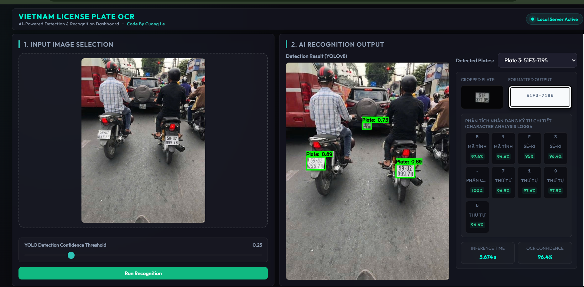
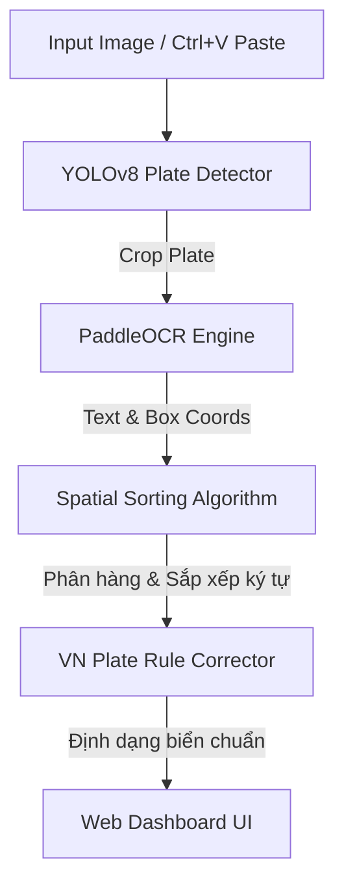

# Vietnam License Plate Recognition (YOLOv8 + PaddleOCR)

Hệ thống phát hiện và nhận dạng biển số xe máy & ô tô Việt Nam sử dụng mô hình học sâu và thuật toán hậu xử lý ảnh số.



---

## ⚙️ Quy Trình Hoạt Động (Pipeline)



---

## 📂 Cấu Trúc Dự Án

- `src/detector.py`: Nhận dạng và cắt vùng biển số (YOLOv8).
- `src/ocr.py`: Nhận diện ký tự, phân hàng biển vuông và hậu sửa lỗi quy chuẩn VN.
- `templates/` & `static/`: Giao diện Web Dashboard (Responsive PC/Mobile).
- `weights/`: Chứa file weights mô hình (`best.pt`, `yolov8n.pt`).
- `main.py`: Điểm khởi chạy máy chủ Flask.
- `.github/workflows/build-exe.yml`: Tự động biên dịch file `.exe` độc lập trên GitHub.

---

## 🚀 Cài Đặt & Chạy Local

```cmd
# 1. Cài đặt các thư viện cần thiết
pip install -r requirements.txt

# 2. Khởi chạy máy chủ
python main.py
```
*Truy cập `http://localhost:5000` trên máy tính hoặc `http://<IP_Mạng_Cục_Bộ>:5000` trên điện thoại chung Wi-Fi.*

---

## 🔗 Tài Nguyên & Huấn Luyện
- **Google Colab (Train model):** [YOLOv8 Training Notebook](https://colab.research.google.com/drive/1TtnaxQIYYFl_H1i-ZZ4Cmz_9A70J9dyY?usp=sharing)
- **Tập dữ liệu (Dataset):** [Roboflow Vietnam License Plate Dataset v2](https://universe.roboflow.com/nguyn-khang-0apuu/vietnam-license-plate-hjswj-xcnw3/dataset/2)
- **Thư viện chính:** OpenCV, Ultralytics YOLOv8, và PaddleOCR.
